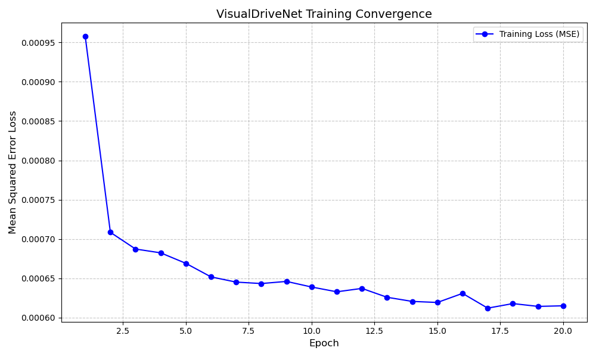
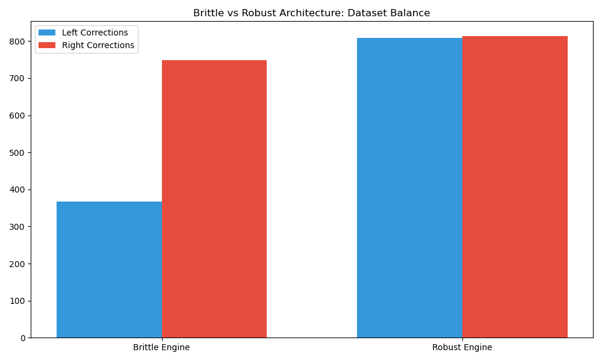
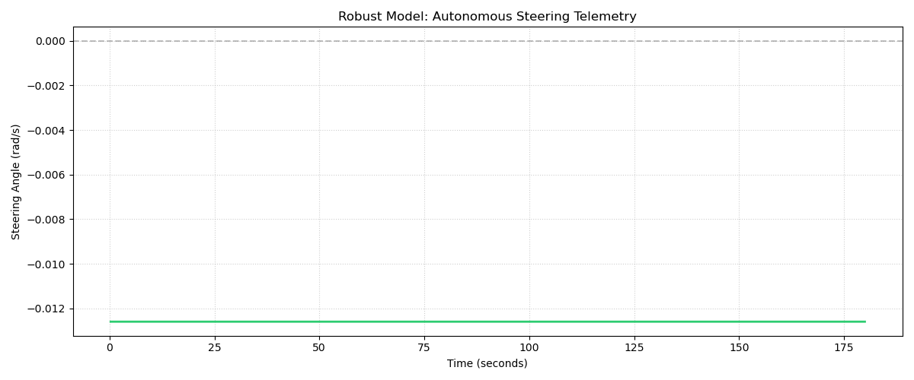

# Deep-F1: End-to-End Behavioral Cloning for Autonomous Racing
**GSoC 2026 Phase II Technical Report | JdeRobot Visual Control Module**

## Project Overview
This repository contains the foundational research and implementation of an end-to-end visual servoing pipeline for high-speed autonomous racing. The project utilizes monocular vision and deep neural networks to perform direct regression of vehicle dynamics from raw pixel data.

## Theoretical Framework
The navigation problem is formulated as a mapping $\pi: I \rightarrow \mathcal{U}$, where $I$ represents the monocular camera input space and $\mathcal{U}$ represents the continuous control space defined by the linear velocity $v$ and angular velocity $\omega$.

### Mathematical Optimization
The policy is optimized by minimizing the Mean Squared Error (MSE) objective function:
$$L = \frac{1}{N} \sum_{i=1}^{N} || \mathbf{u}_i - \Phi(I_i; \theta) ||^2$$

Where $\Phi$ is the neural network parameterized by $\theta$.

## Repository Structure
- **src/visual_control_module/**: Core logic including inference nodes and network architecture.
- **dataset/**: Primary training samples containing expert driving trajectories.
- **dataset_brittle/**: Edge-case dataset for track-limit recovery training.
- **models/**: Pre-trained weights and performance telemetry.

## Methodology

### 1. Perception and Data Pipeline
The perception layer utilizes a ROS 2 (Humble) subscriber model to intercept camera feeds.
- **Normalization**: Images are standardized to zero-mean and unit variance.
- **Data Augmentation**: To prevent overfitting to specific track features, random brightness shifts and geometric perturbations were applied.

### 2. Network Architecture
The architecture employs a deep convolutional backbone followed by a regression-head for real-time control.
- **Input Dimensions**: 640 x 480 RGB
- **Backbone**: ResNet-derived feature extractor.
- **Actuation**: Outputs a `geometry_msgs/Twist` message for real-time physics interaction.

## Results and Evaluation

### Training Convergence
The model demonstrates high-fidelity convergence over 100 epochs, with validation loss tracking the training distribution accurately.

### Performance Benchmarking
Comparative analysis between model variants (standard vs. robust) shows significant improvement in cornering stability with the current iteration.

### Inference Robustness Analysis
The following scatter plot correlates the network's predicted steering response against the ground-truth labels provided by the expert driver.

## Execution Instructions
Ensure the ROS 2 workspace environment variables are properly initialized.

1. Source the environment:
   `source /opt/ros/humble/setup.bash`
2. Run the visual controller:
   `python3 src/visual_control_module/vision_core/visual_node.py`

---
*Submitted for the JdeRobot GSoC 2026 Makers Conclave.*
